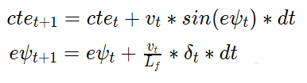

# MPC-Controller

## 1. Objective
The main goal of the project is to implement in C++ Model Predictive Control (MPC) to drive the car (to follow a reference trajectory) around the track in a simulator. The program uses a simple Global Kinematic Model. The simulator provides reference trajectory (yellow line at the track centre, in the demo video) via websocket. We use MPC to compute steering and throttle commands to align the car from its current position to the reference trajectory. This computation is performed at every time step because after the application of commands, car has moved and now has a new reference. The solution must be robust to 100ms latency, since it might encounter in real-world application.

In this project, the MPC optimize the actuators (provides optimized steering and throttle values) that minimize the cost like cross-track error, and subject to constraints like steering/throttle values cannot change abruptly.

## 2. Kinematic model

A kinematic model is implemented to control the vehicle around the track. Kinematic models are simplifications of dynamic models that ignore tire forces, gravity, and mass. This simplification reduces the accuracy of the models, but it also makes them more tractable. At low and moderate speeds, kinematic models often approximate the actual vehicle dynamics.

**States**: 

Position (_x,y_), heading (_ψ_) and velocity (_v_) form the vehicle state vector:

State: _[x,y,ψ,v]_

**Actuator values**:

There are two actuators. Stearing angle (_δ_) is the first one, it should be in range [-25,25] deg. For simplicity the throttle and brake represented as a singular actuator (_a_), with negative values signifying braking and positive values signifying acceleration. It should be in range [-1,1].

Actuators: _[δ,a]_

**Update equations**:

The kinematic model can predict the state on the next time step (state at t+1) from the current state (state vector at t) and actuators values as follows:

where _Lf_ measures the distance between the front of the vehicle and its center of gravity. The parameter was provided by Udacity.

**Model Errors**:

Errors: cross track error (_cte_) and _ψ_ error (_eψ_) were used to build the cost function for the MPC. They could be updated on a new time step using the following equations:

## 3. Implementation

We'll use MPC to follow the trajectory along a line.

Steps:

* Set N and dt.
* Fit the polynomial to the waypoints.
* Calculate initial cross track error and orientation error values.
* Define the components of the cost function (state, actuators, etc). 
* Define the model constraints. These are the state update equations defined in the Vehicle Models module.
* Compute optimized control inputs using Ipopt tool

Ipopt is the tool we'll be using to optimize the control inputs [δ1,a1,...,δN−1,aN−1]. It's able to find locally optimal values (non-linear problem!) while keeping the constraints set directly to the actuators and the constraints defined by the vehicle model. Ipopt requires we give it the jacobians and hessians directly - it does not compute them for us. Instead of manually computing them, we use a CppAD library do this for us.

## 4. Design Choices

- **Timestep Length and Elapsed Duration (N & dt)**: 

The values chosen for N and dt are 10 and 0.1, respectively. Admittedly, this was at the suggestion of Udacity's provided office hours for the project.

Adjusting either N or dt (even by small amounts) often produced erratic behavior. Other values tried include 20 / 0.05, 8 / 0.125, 6 / 0.15, and many others. 

- **Polynomial Fitting and MPC Preprocessing**:

The waypoints are preprocessed by transforming them to the vehicle's local coordinate system (see main.cpp lines 108-113), such that the vehicle's x and y coordinates are now at the origin (0, 0) and the orientation angle is also zero. 

A 3rd order polynomial is used as an estimate of the current road curve ahead, as it is a good fit of most roads.

- **Model Predictive Control that handles 100ms Latency**: 

The original kinematic equations depend upon the actuations from the previous timestep, but with a delay of 100ms (which happens to be the timestep interval) the actuations are applied another timestep later, so the equations have been altered to account for this (MPC.cpp lines 104-107). 
